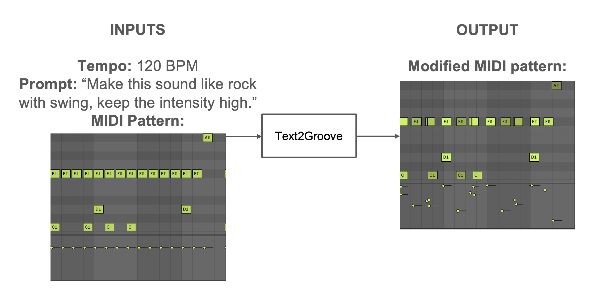
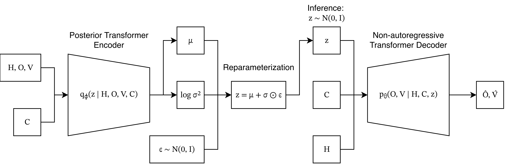

# Text2Groove
Text2Groove is a Text-guided MIDI humanization system that transforms quantized drum patterns according to natural language descriptions of genre, rhythmic feel, and dynamics. Given a MIDI file with a quantized drum pattern and natural language prompt describing the desired expressive characteristics, Text2Groove generates timing offsets and velocities based on the prompt and applies them to the given MIDI file. 

This work will be presented at ISMIR 2026 as a Late-Breaking Demo.



## Dependencies
This repo is written in Python 3.12 with PyTorch as the deep learning framework. To install the required python packages, run the following

```
pip install -r requirements.txt
```

## Run Inference on example MIDI files

Once the required Python packages are installed, open the notebook `Project Code/inference_text2groove.ipynb`, change the inference parameters `INPUT_MIDI_PATH`, `PROMPT` and `OUTPUT_MIDI_PATH`, and run the notebook. 

Note: Text2Groove follows the industry standard General MIDI Percussion Mapping to map specific drums to MIDI note numbers. https://midi.org/midi-ci-profile-for-default-drum-note-map

`INPUT_MIDI_PATH` is the path to the quantized MIDI file given to Text2Groove representing the drum score. Some example input MIDI files are provided in the Example Input MIDI folder. By default, Text2Groove uses the tempo information stored in the input MIDI file's metadata.

`PROMPT` is the prompt given to Text2Groove describing the desired expressive characteristics of the output.

`OUTPUT_MIDI_PATH` is the path of the output MIDI file of the input drum score with expressive characteristics applied.

## Data 
Google Magenta's Groove MIDI Dataset is required for training: https://magenta.withgoogle.com/datasets/groove

The MIDI-only version should suffice since training does not require the audio files. 

## Training

### Run the pipeline script 
Run the training pipeline script with the path to the Groove MIDI Dataset as an argument 
`python run_pipeline.py /path/to/groove_midi_dataset`

The script does the following:
1. Preprocess the groove midi dataset to extract 2 bar patterns as described in https://proceedings.mlr.press/v97/gillick19a.html and measures groove features for each pattern. The patterns and metadata are then saved to processed_groove_dataset_split.h5.

2. Synthesizes additional training data through nearest neighbour groove transfer. The training data is then saved to groove_training_pairs_genre.h5.

3. Trains the CVAE on the data in groove_training_pairs_genre.h5 and outputs the model to text2groove_model.pt.

## Architecture 

The main architecture of the model is a Conditional Variational Autoencoder. This was chosen because the same score and the same description can be performed in many slightly different ways, so we wanted the model to be able to generate variations as well, rather than always outputting one deterministic result. During training, the encoder takes the hit pattern, timing offsets, velocities, and conditioning, and outputs the mean and log variance of the latent distribution, which we then use to sample a latent vector z using the reparameterization trick. The decoder receives hit pattern, conditioning and z and predicts the humanized offsets velocities. At inference time, we sample z from a standard normal distribution, which means we can generate different humanized performances from the same drum pattern and prompt.




## Further Details

This project began as my Sound and Music Computing MSc dissertation at Queen Mary University of London. As such, further details on the motivation, methodology and limitations can be found in the full [dissertation paper](Text2Groove_Dissertation_Adrian_Lam.pdf). 

## Contact
Please feel free to contact me if you have any questions about the project!

Email: adrian1219@ymail.com

LinkedIn: https://www.linkedin.com/in/adrian-kt-lam/
